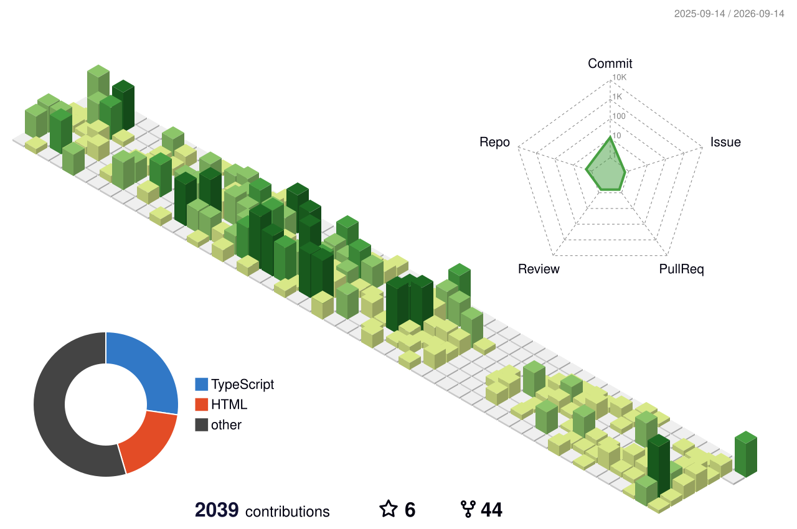

## :octocat: Hi, I'm Bharat Malik

**Senior Software Engineer · Full-Stack · 3+ years**

Full-stack engineer building and leading scalable web apps with React.js, Next.js, Node.js, TypeScript, and Nest.js. I own work end-to-end — architecture, delivery, code review, and production. Currently exploring agentic AI systems, RAG pipelines, and LangGraph workflows.

- 🌱 Exploring agentic AI, RAG, and LangGraph for real product workflows
- 👯 Open to collaborating on interesting web and AI projects
- 💬 Ask me about full-stack engineering, Shopify apps, or AI tooling

### Tech Stack

**Languages:** JavaScript · TypeScript · C++ · Python  
**Frontend:** React.js · Next.js · Redux · HTML5 · CSS3  
**Backend:** Node.js · Nest.js · PostgreSQL · REST · Microservices  
**AI / ML:** RAG · LangGraph · LLM integration · Prompt engineering  
**Other:** Shopify · CI/CD · System design · Mentoring

<b>GitHub Stats</b>

 

  
  

  <picture>
    <source media="(prefers-color-scheme: dark)" srcset="./profile/github-snake-dark.svg" />
    <source media="(prefers-color-scheme: light)" srcset="./profile/github-snake.svg" />
    
  </picture>

  

  

